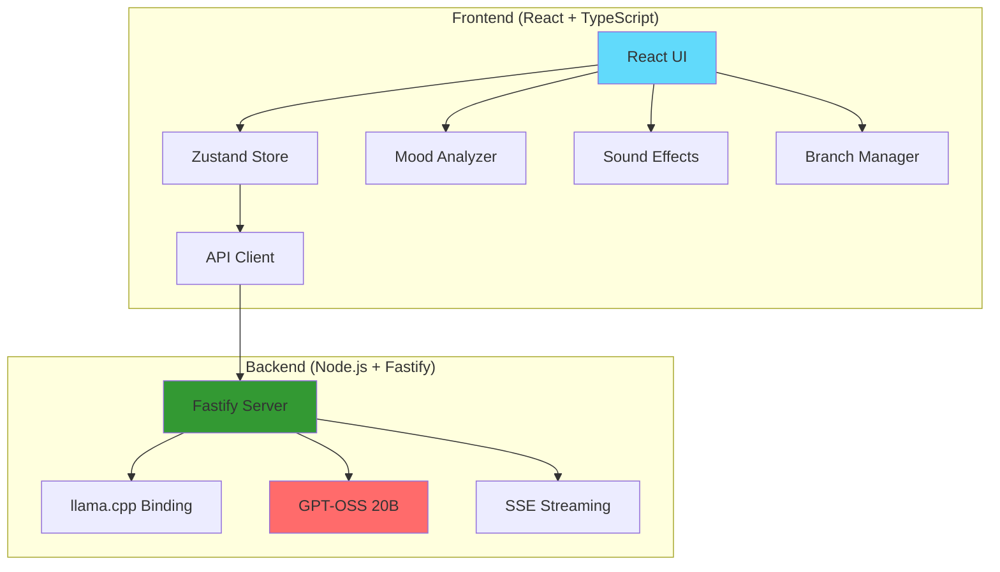

# 🌈 Bifrost AI: Local LLM with Time Travel & Mood Magic ✨

<div align="center">
  
  
  
  
  
  
  <h3>🚀 Run GPT-OSS 20B locally with conversation branching, mood-reactive UI, and chain-of-thought reasoning</h3>
  
  [Features](#-features) • [Demo](#-demo) • [Quick Start](#-quick-start) • [Architecture](#-architecture)
  
</div>

---

## 🎥 Demo

<div align="center">
  
</div>

## ✨ Features

### 🔮 **Time Machine** - Branch Your Conversations
- **Fork any conversation** at any point in history
- **Explore alternate timelines** - What if you asked differently?
- **Visual branch management** in an elegant sidebar tree
- **Seamless switching** between conversation branches

### 🎨 **Mood-Reactive UI** - Your Chat Has Feelings
- **Dynamic theming** that responds to conversation tone
- **5 mood states**: Happy 🌞, Serious 🎯, Creative 🎨, Analytical 🔬, Emotional 💝
- **Smooth color transitions** and ambient animations
- **Mood-based sound effects** using Web Audio API

### 🧩 **Chain-of-Thought Reasoning** - See How AI Thinks
- **Toggle reasoning visibility** - Show or hide the AI's thinking process
- **Harmony format support** - Structured reasoning with analysis channels
- **Collapsible reasoning boxes** - Clean UI with optional depth
- **Two-phase generation** - Separate thinking from answering

### ⚡ **Blazing Fast Local Inference**
- **GPT-OSS 20B Q4_K_M** - State-of-the-art open model
- **Hardware acceleration** via llama.cpp
- **Streaming responses** with Server-Sent Events
- **Smart context management** - 4096 token window

### 🎯 **Developer Experience**
- **Full TypeScript** - Type safety everywhere
- **Monorepo architecture** - Clean separation of concerns
- **Hot module replacement** - Instant development feedback
- **Production-ready build** - Optimized bundles

## 🚀 Quick Start

### Prerequisites
- Node.js 18+ and pnpm
- 16GB+ RAM recommended
- macOS (Apple Silicon optimized) / Linux / Windows WSL2

### Installation

```bash
# Clone the repository
git clone https://github.com/sderosiaux/bifrost-ai.git
cd bifrost-ai

# Install dependencies
pnpm install

# Configure environment (optional - defaults work out of the box)
cp apps/server/.env.example apps/server/.env

# Start development servers
pnpm dev
```

Visit `http://localhost:5173` and start chatting! 🎉

The model (11GB) will auto-download on first run with resume support.

### Production Build

```bash
# Build for production
pnpm build

# Run production servers
NODE_ENV=production pnpm start
```

## 🏗️ Architecture



## 🎮 Key Features Explained

### Time Machine Branching 🌳

Create alternate conversation timelines by forking at any assistant response:

```typescript
// Branch from any message
createBranch(messageId: string) {
  // Creates new timeline with shared history
  // Preserves context up to branch point
  // Allows exploration of different paths
}
```

### Mood Detection Algorithm 🎭

Analyzes conversation sentiment in real-time:

```typescript
// Keywords trigger mood changes
const moodKeywords = {
  happy: ['excited', 'wonderful', 'amazing'],
  serious: ['important', 'critical', 'urgent'],
  creative: ['imagine', 'create', 'design'],
  // ... more moods
}
```

### Harmony Format for Reasoning 🧠

Structured output with separate reasoning and answer channels:

```
<|channel|>analysis<|message|>
Let me think through this step-by-step...
<|end|>

<|channel|>final<|message|>
Here's my answer...
<|end|>
```

## 🛠️ Tech Stack

- **Frontend**: React 18, TypeScript, Tailwind CSS, Zustand, Vite
- **Backend**: Node.js, Fastify, node-llama-cpp v3
- **AI Model**: GPT-OSS 20B Quantized (Q4_K_M)
- **Tooling**: pnpm workspaces, ESLint, Prettier

## 📂 Project Structure

```
├── apps/
│   ├── web/              # React frontend
│   │   ├── src/
│   │   │   ├── components/   # UI components
│   │   │   ├── lib/          # Utilities & stores
│   │   │   └── App.tsx       # Main app
│   │   └── package.json
│   │
│   └── server/           # Node.js backend
│       ├── src/
│       │   ├── routes/       # API routes
│       │   ├── lib/          # Core logic
│       │   └── index.ts      # Server entry
│       └── package.json
│
├── package.json          # Root package
└── pnpm-workspace.yaml   # Monorepo config
```

## 🔧 Configuration

Environment variables (`.env`):

```bash
# Model configuration
MODEL_URL=https://huggingface.co/mradermacher/GPT-OSS-20B-GGUF/resolve/main/GPT-OSS-20B-Q4_K_M.gguf
MODEL_SHA256=4c35ebe841e8f0c362b8cd44ef6a78ad5e15e7a8e10bc008285797c1a5c87788

# Server configuration
PORT=5174
WEB_ORIGIN=http://localhost:5173
```

## 🤝 Contributing

We love contributions! Check out our [Contributing Guide](CONTRIBUTING.md) to get started.

1. Fork the repository
2. Create your feature branch (`git checkout -b feature/amazing-feature`)
3. Commit your changes (`git commit -m 'Add amazing feature'`)
4. Push to the branch (`git push origin feature/amazing-feature`)
5. Open a Pull Request

## 📜 License

MIT License - see [LICENSE](LICENSE) file for details.

## 🌟 Star History

[](https://star-history.com/#sderosiaux/bifrost-ai&Date)

## 🙏 Acknowledgments

- [GPT-OSS](https://huggingface.co/gpt-oss/GPT-OSS-20B) team for the amazing model
- [llama.cpp](https://github.com/ggerganov/llama.cpp) for blazing fast inference
- [node-llama-cpp](https://github.com/withcatai/node-llama-cpp) for Node.js bindings
- The open-source AI community 💚

---

<div align="center">
  
  **Built with ❤️ by the community, for the community**
  
  [Report Bug](https://github.com/sderosiaux/bifrost-ai/issues) • [Request Feature](https://github.com/sderosiaux/bifrost-ai/issues)
  
</div>